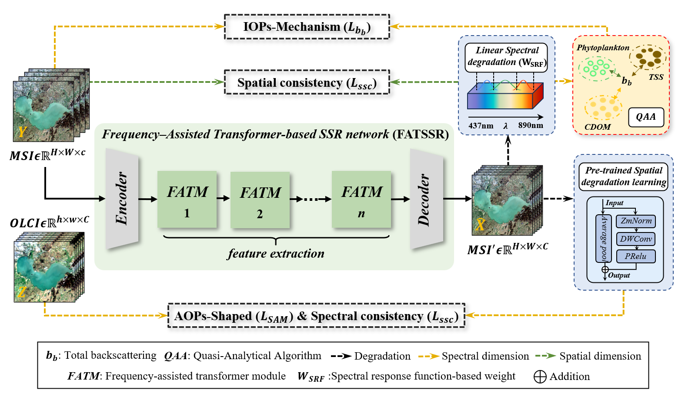

# W-SpectralFormer

<p align="center">
  <b>A Physics-Informed Transformer for Weakly Supervised Spectral Super-Resolution of Inland Lake Reflectance</b>
</p>

<p align="center">
  
  
  
  
</p>

---

## Introduction

**W-SpectralFormer** is a weakly supervised spectral super-resolution framework for reconstructing high-fidelity remote sensing reflectance over inland lakes.

The model aims to enhance Sentinel-2 MSI imagery by reconstructing narrow spectral bands with the guidance of Sentinel-3 OLCI observations. By combining Transformer-based spectral feature learning, degradation estimation, and water optical property constraints, W-SpectralFormer provides a practical solution for high-resolution inland water quality monitoring.

<p align="center">
  
</p>

<p align="center">
  <i>Overall workflow of W-SpectralFormer.</i>
</p>

---

## Highlights

- **Weakly supervised learning**  
  No ideal high-spatial-resolution hyperspectral labels are required.

- **Two-stage training strategy**  
  The degradation estimation network is first trained to model MSI-OLCI spatial-spectral relationships, followed by spectral super-resolution training.

- **Physics-informed spectral reconstruction**  
  Water optical properties are introduced to constrain the reconstructed reflectance.

- **Frequency-assisted Transformer**  
  FFT-enhanced spectral tokens help preserve subtle spectral details in inland waters.

- **Water quality application**  
  The reconstructed reflectance can support more reliable chlorophyll-a concentration estimation.

---

## Code Structure

```text
W-SpectralFormer/
└── Network/
    ├── Part_One_Deg/
    │   ├── datasets.py
    │   ├── Deg_loss.py
    │   ├── Deg_net.py
    │   ├── Deg_net.png
    │   ├── train.py
    │   └── utils.py
    │
    └── Part_two_SSR/
        ├── Network/
        │   ├── FATM.py
        │   ├── FATSSR.png
        │   ├── FATSSR.py
        │   ├── whole_work.png
        │   └── whole_work.py
        ├── datasets.py
        ├── Physics_loss.py
        ├── Train.py
        └── utils.py
